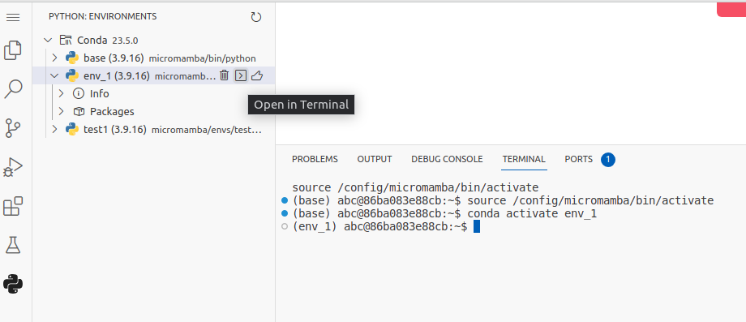

### Install
1. there are 2 ways to launch the 1st through space
    2nd via docker

    - docker-compose build and docker-compose up

    - via terminal

            
    ```
        docker run -d \
            --name=code-server \
            -e PUID=1000 \
            -e PGID=1000 \
            -e TZ=Etc/UTC \
            -e PASSWORD=password `#optional` \
            -e HASHED_PASSWORD= `#optional` \
            -e SUDO_PASSWORD=password `#optional` \
            -e SUDO_PASSWORD_HASH= `#optional` \
            -e PROXY_DOMAIN=code-server.my.domain `#optional` \
            -e DEFAULT_WORKSPACE=/config/workspace `#optional` \
            -p 8443:8443 \
            -v /path/to/appdata/config:/config \
            --restart unless-stopped \
            lscr.io/linuxserver/code-server:latest
    ```
    ```first 2 methods install clean server code (no modules - Python, Python Environment Manager, Anaconda, )```

    - there is 1 method that deploys the server code already with pre-installed modules, to expand it: 
     ```docker load --input code-server-mod.tar```
    after that the image will be loaded, launch it
    ```
        docker run -d \
            --name=code-server-mod \
            -e PUID=1000 \
            -e PGID=1000 \
            -e TZ=Etc/UTC \
            -e PASSWORD=password `#optional` \
            -e HASHED_PASSWORD= `#optional` \
            -e SUDO_PASSWORD=password `#optional` \
            -e SUDO_PASSWORD_HASH= `#optional` \
            -e PROXY_DOMAIN=code-server.my.domain `#optional` \
            -e DEFAULT_WORKSPACE=/config/workspace `#optional` \
            -p 8443:8443 \
            -v /path/to/appdata/config:/config \
            --restart unless-stopped \
            lscr.io/linuxserver/code-server:latest
    ```

2. Working with environments:
    tested loading the folder with the environment (from the local environment to the server), if placed in the correct folder, the micromamba sees this folder and uses it as the default environment

    

    ```the command in the terminal is entered automatically after clicking on "open in terminal" ```